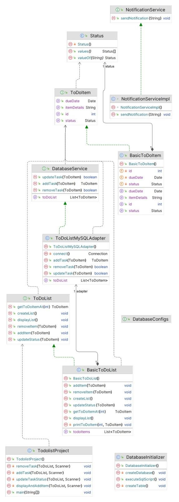

# todolist
This is my Data Structures and Algorithms Final Project, apart of course CMP-233 while attending the County College of Morris. 

Author : Favio Valentino Jasso 

For : Professor Bamford 

Class : Data Structures and Algorithms 

Project : To Do List\
\
The ToDo List Application is a simple yet efficient task management tool designed to help users organize their tasks effectively. The application utilizes a JDBC Adapter layer to perform CRUD operations on a MySQL database. The database schema is defined in the schema.sql file, which is executed during the program startup to set up the necessary tables and the list data structure.

- The schema.sql file contains the SQL commands necessary to create the database ToDoListDB and the ToDoItems table within it.

- The ToDoItems table consists of columns for id, description, dueDate, and status, facilitating the storage of task information.

- The JDBC Adapter layer is implemented to interact with the MySQL database and perform CRUD operations.

- It provides methods to:

1. Create new tasks

2. Retrieve existing tasks

3. Update task information

4. Delete tasks

- Users can add new tasks with descriptions and due dates.

- Tasks can be marked as 'NOT\_STARTED', 'IN\_PROGRESS', or 'COMPLETED'.

- Users can update task details such as descriptions, due dates, and status.

- Tasks can be deleted once completed or are no longer required.

- The application integrates with the MySQL database using JDBC.

- All task-related data is stored and retrieved from the ToDoItems table.

